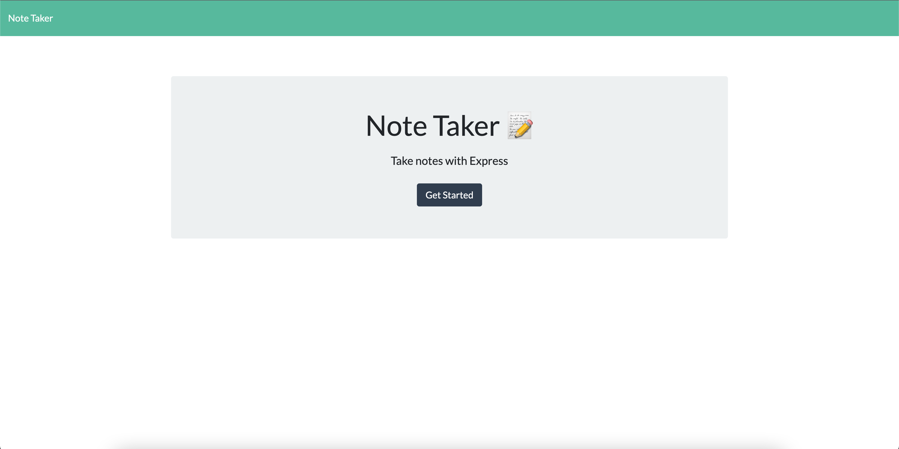
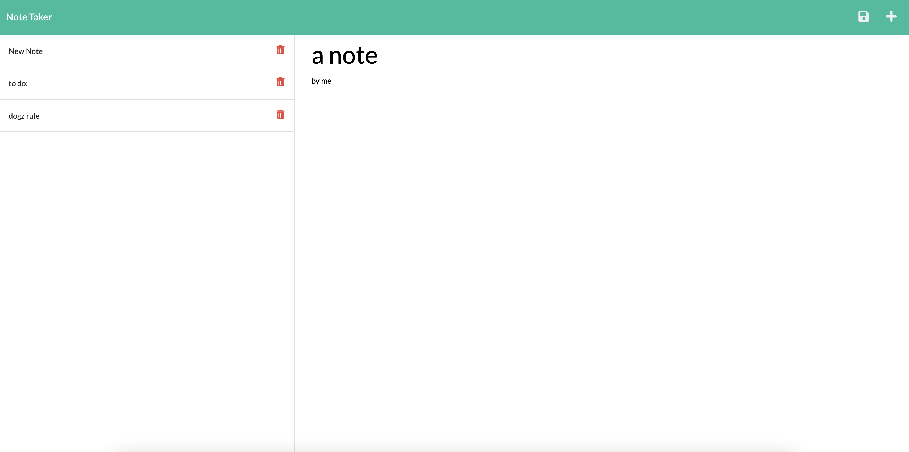

# Note Taker

## Description

This web application gives the user the ability to submit notes and save them for later use. Once the homepage is opened the user clicks the "Get Started" button and is then able to take notes, save them and access them later.

Deployed Link with Heroku:
https://morning-meadow-72326.herokuapp.com/

## Table of Contents

- [Installation](#installation)
- [Usage](#Usage)
- [Links](#links)
- [Features](#features)
- [Contact](#Contact)

## Installation

- Download or clone repository
- npm install to install the required npm packages to run

## Usage

Run the server with: node server.js

Navigate to: http://localhost:3000

The user can add transactions as deposits or expenses by inputting the following:

Click add 'Get Started'

Type new note and save

Delete notes when finished

## Links

- Github: https://nascott94.github.io/note-taker/
- Heroku: https://morning-meadow-72326.herokuapp.com/

## Contact

Contact nascott94@outlook.com for any questions.
